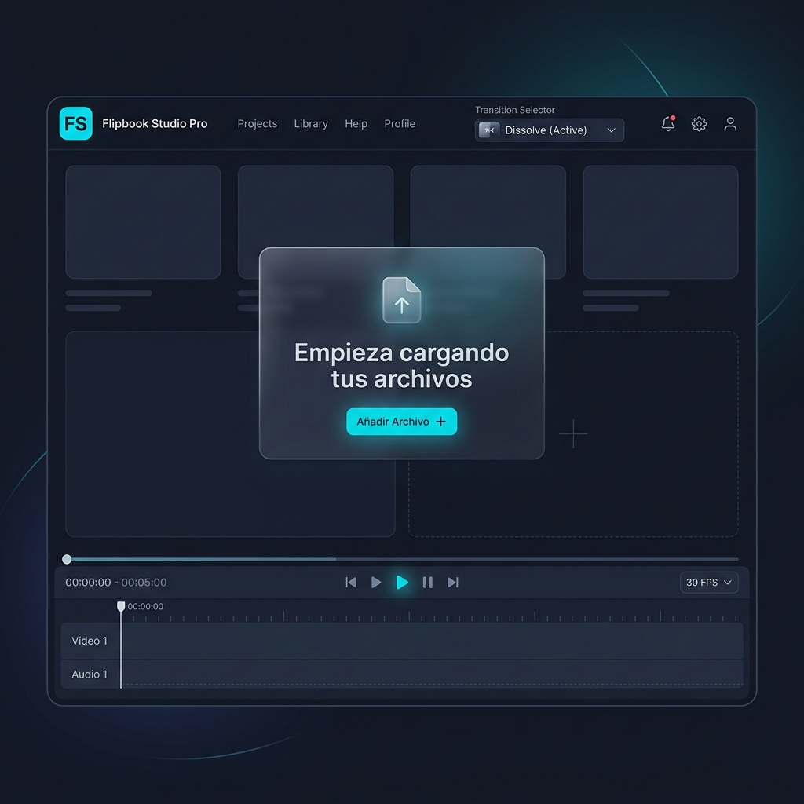
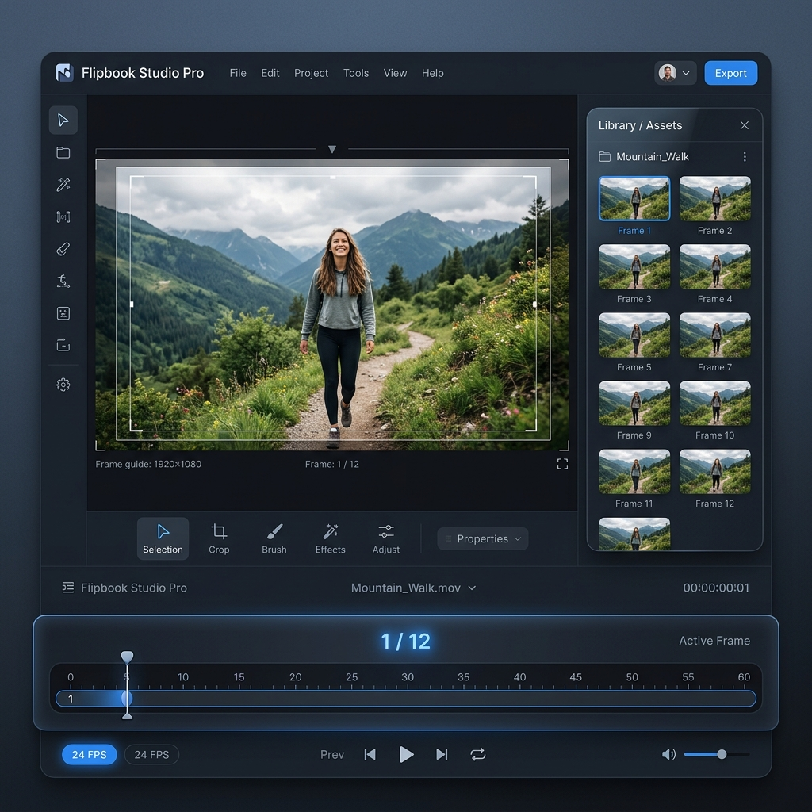

# 🎬 Flipbook Studio Pro

**Reproductor profesional de secuencias de imágenes y videos con efectos de transición WebGL 3D.**  
Carga tus imágenes o videos directamente desde tu equipo y reprodúcelos como animación *Flipbook* con transiciones configurables a nivel de software de edición.

---

## 🎨 Capturas de Pantalla

### 1. Estado inicial (Stage listo para cargar medios)


### 2. Reproducción activa con Galería de Medios abierta


---

## ✨ Características

| Función | Detalle |
|---|---|
| 🖼️ **Carga Flexible** | Arrastra imágenes (JPG, PNG, WEBP, GIF) o videos (MP4, WEBM) |
| 🎞️ **Modo Flipbook** | Animación fotograma a fotograma con velocidad configurable |
| 🎬 **Videos Secuenciales** | Reproducción continua de videos uno tras otro |
| 🌊 **Transición WebGL 3D** | Efecto onda líquida con Shaders GLSL vía Three.js |
| ✨ **Fundido Suave (Fade)** | Transición cruzada elegante entre fotogramas |
| ⚡ **Corte Instantáneo** | Sin efectos — ideal para Flipbook rápido |
| 📊 **Timeline Interactivo** | Barra de progreso con scrubber arrastrable |
| ⏱️ **Presets de FPS** | Botones de velocidad rápida: 24, 10, 5 y 1 FPS |
| 🔁 **Bucle** | Repetición infinita activable/desactivable |
| ⛶ **Pantalla Completa** | Soporte nativo fullscreen API |
| ⌨️ **Atajos de Teclado** | Espacio (Play/Pausa) · ← → (Fotograma anterior/siguiente) |
| 🗂️ **Galería de Medios** | Panel lateral con miniaturas, formato y botones de eliminación |

---

## 🚀 Cómo Usar

1. **Clona el repositorio:**
   ```bash
   git clone git@github.com:j28c-run/FlipBook-Studio.git
   ```

2. **Abre el archivo principal en tu navegador:**
   ```
   index.html
   ```
   > No requiere servidor ni instalación. Funciona 100% en el navegador.

3. **Carga tus archivos:**
   - Haz clic en **"Galería de Medios"** en el header o arrastra tus imágenes al centro.

4. **Reproduce:**
   - Presiona **▶ Play** o pulsa la tecla **Espacio**.
   - Elige la velocidad (`24 FPS`, `10 FPS`, `5 FPS`, `1 FPS`) y la transición (Instantánea, Fade, WebGL Líquida).

---

## 🛠️ Tecnologías

- **HTML5** + **CSS3** (Variables CSS, Grid, Flexbox, Glassmorphism)
- **JavaScript** ES6+
- **[Three.js r83](https://threejs.org/)** — Motor 3D WebGL con Shaders GLSL
- **[GSAP 1.20](https://greensock.com/gsap/)** — Transiciones suaves
- **Google Fonts** — Tipografía *Inter*

---

## 📋 Atajos de Teclado

| Tecla | Acción |
|---|---|
| `Espacio` | Play / Pausa |
| `←` Flecha Izquierda | Fotograma anterior |
| `→` Flecha Derecha | Fotograma siguiente |

---

## 📄 Licencia

MIT — Libre de usar, modificar y distribuir.
